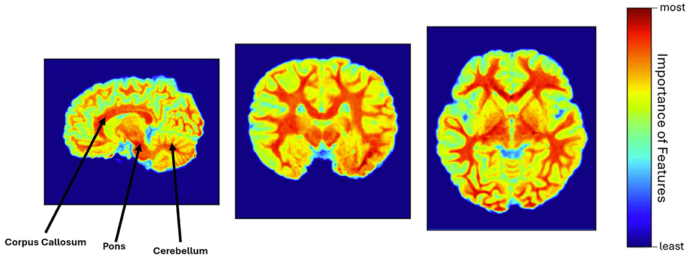

<div align="center">
  
# Deep learning for detecting prenatal alcohol exposure in pediatric brain MRI: a transfer learning approach with explainability insights
</div>

<h3 align="center">
  <a href="https://www.frontiersin.org/journals/computational-neuroscience/articles/10.3389/fncom.2024.1434421/full">Paper Link*</a> |
  <a href="">Video</a> |
  <a href="">Poster</a> |
  <a href="">Slides</a>
</h3>

<br><br>


## Table of Contents:
1. [Overview](#overview)
2. [News](#news)
3. [Getting Started](#start)
4. [Results](#results)
5. [Citation](#citation)
6. [License](#license)
7. [Related Resources](#resources)

## Overview* <a name="overview"></a>
Prenatal alcohol exposure (PAE) refers to the exposure of the developing fetus due to alcohol consumption during pregnancy, which disrupts the neurodevelopmental process and may result in long-term cognitive and behavioral abnormalities. Pediatric (2 to 8 years old) brain abnormalities associated with PAE are often subtle and differ across individuals, complicating early diagnosis. Although deep learning (DL) approaches have been promising in adult-centric brain magnetic resonance (MR) image analysis, there are challenges in pediatric-specific analysis due to limited data and a lack of explainability insights. This study incorporated deep transfer learning (TL) and explainable artificial intelligence (XAI) techniques to classify between unexposed controls and PAE in pediatric brain MR scans, followed by identifying brain regions (features) that were responsible for the decision-making process.

## News <a name="news"></a>
This work was published in Frontiers in Computational Neuroscience. DOI: https://doi.org/10.3389/fncom.2024.1434421.

## Getting Started* <a name="start"></a>
**Dataset:** Unexposed controls T1-weighted brain MR scans are publicly available at https://osf.io/axz5r/. However, the PAE data is private and may not be accessible upon request.

**Preprocessing:** Skull stripping with FSL-BET and SynthStrip, atlas-based linear registration (6-degree of freedom) with FSL-FLIRT, bias field correction with N4 technique, min-max normalization, resizing, and random 3D rotation as augmentation during training.

**Classification:** Feature extraction with pre-trained Simple Fully Convolutional Network (SFCN) [https://github.com/ha-ha-ha-han/UKBiobank_deep_pretrain/]. Then a shallow classifier with Adam optimizer and binary cross-entropy loss was trained with the extracted features.

**Explainability:** Gradient-weighted class activation mapping (Grad-CAM) to evaluate the explainability of the feature extraction step. Generated heatmap was resized to input scan size to produce blended image by overlaying the heatmap and input MR scan.

**Frameworks/Libraries & Tools:** Pytorch, MONAI, SimpleITK, Grad-CAM, FSL, SynthStrip.


## Results* <a name="results"></a>
<p align="left">
  
  <br>
  <em>Table 1: Comparison of sensitivity, specificity, and average accuracy with standard deviation on the testing dataset for four different cases where case I and case II experienced a higher specificity but a lower sensitivity score. Conversely, cases III and IV exhibited a higher sensitivity and a high average accuracy and deviation.</em>
</p>

<p align="left">
  
  <br>
  <em>Figure 1: Heatmap visualization using Grad-CAM, where corpus callosum, pons, cerebellum, and white matter were identified as the most relevant features of the brain (warm red color), involved in the model's decision-making process.</em>
</p>


## Citation* <a name="citation"></a>

If you find our project useful for your research, please consider citing our paper and codebase with the following BibTeX:

```bibtex
@article{das2024deep,
  title={Deep learning for detecting prenatal alcohol exposure in pediatric brain MRI: a transfer learning approach with explainability insights},
  author={Das, Anik and Duarte, Kaue and Lebel, Catherine and Bento, Mariana},
  journal={Frontiers in Computational Neuroscience},
  volume={18},
  pages={1434421},
  year={2024},
  publisher={Frontiers Media SA}
}
```

## License <a name="license"></a>
Nothing to mention.

## Related Resources <a name="resources"></a>
- [Related Literature-1](https://www.spiedigitallibrary.org/conference-proceedings-of-spie/13407/1340723/A-comprehensive-processing-framework-crafted-for-pediatric-brain-MRI/10.1117/12.3047146.short) Preprocessing framework for pediatric brain MRI
- [Related Literature-2](https://ieeexplore.ieee.org/abstract/document/10373445) Comparative skull stripping techniques on pediatric brain MRI
- [Related Literature-3](https://ieeexplore.ieee.org/abstract/document/10783636) Data augmentation to improve Prenatal Alcohol Exposure classification
